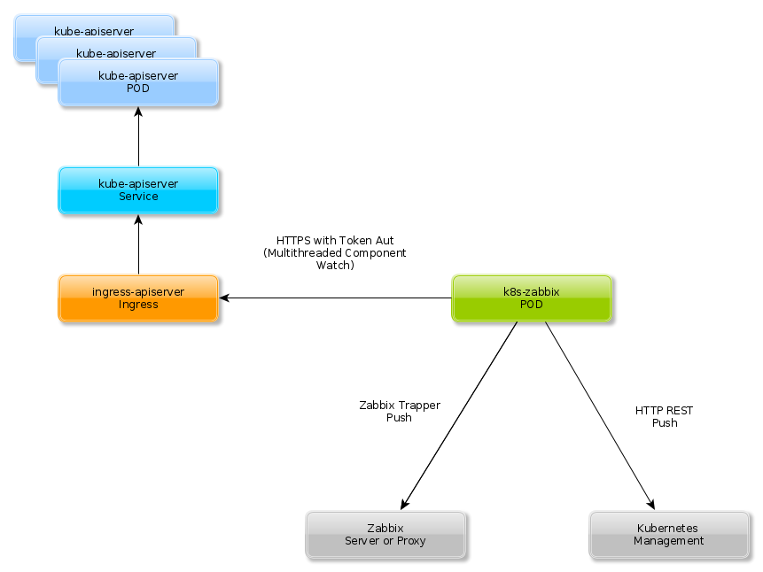

k8s-zabbix
=================

This project provides kubernetes monitoring capabilities for zabbix using the watch api method.

This means that new Kubernetes entities are created without delay via zabbix discovery and transferred to Zabbix. 
For example, the moment a deployment is created, it is also created in Zabbix using the [LLD](https://www.zabbix.com/documentation/current/manual/discovery/low_level_discovery) and its status changes are transferred to Zabbix without significant delay.
This tool aggregates status information of entities in some cases to the managing entity to improve the practical usage with zabbix
(example: aggegation of the pod statuses to the deployment which manages the pods)
Disappearing entities will be deleted by zabbix using the "Keep lost resources period" setting.

Optionally this tool can submit kubernetes entities to a webservice in unaggregated manner.
This might be a very useful thing if you have left the GitOps paradigm behind and built a real management system for your infrastructure. 

* apiserver : Check and discover apiservers
* components : Check and discover health of k8s components (etcd, controller-manager, scheduler etc.)
* nodes: Check and discover active nodes
* pods: Check pods for restarts
* deployments: Check and discover deployments
* daemonsets: Check and discover daemonsets readiness
* replicasets: Check and discover replicasets readiness
* tls: Check tls secrets expiration dates

For details of the monitored kubernetes attributes, have a look at the [documentation](http://htmlpreview.github.io/?https://github.com/zabbix-tooling/k8s-zabbix/blob/master/documentation/template/custom_service_kubernetes.html)

The current docker image is published at https://hub.docker.com/repository/docker/scoopex666/k8s-zabbix/

Architecture Details
=====================




Behavior of the system:

* k8s-zabbix queries the kubernetes api service for several types of k8s entities (see above)
* discovered data is stored in a internal cache of k8s-zabbix
* new k8s entities are sent to zabbix or optionally to a configurable webservice
* if a k8s entity disappears, zabbix or optionally to a configurable webservice are notified
* if k8s entities appear/disappear the zabbix discovefor low level disovery is updated
* known entities will be resended to zabbix or the webservice in a schedule


Testing and development
=======================


* Clone Repo and install dependencies
  ```
  git clone git@github.com:zabbix-tooling/k8s-zabbix.git
  virtualenv -p python3 venv
  source venv/bin/activate
  pip3 install -r requirements.txt
  ```
* Create monitoring account
  ```
  kubectl apply -f kubernetes/monitoring-user.yaml
  ```
* Gather API Key
  ```
  kubectl get secrets -n monitoring
  kubectl describe secret -n monitoring <id>
  ```
* Test
  ```
  source venv/bin/activate
  cp config_default.py configd_c1.py
  ./check_kubernetesd configd_c1
  ```
* Test in docker (IS ESSENTIAL FOR PUBLISH)
  ```
  ./build.sh default
  ```
* Create release
  ```
  git tag NEW_TAG
  git push --tags
  ./build.sh publish_image
  ```
Production Deployment
=====================

* Clone Repo and install dependencies
  ```
  git clone git@github.com:zabbix-tooling/k8s-zabbix.git
  ```
* Clone Repo and install dependencies
  ```
  ./build.sh default
  MY_PRIVATE_REGISTRY="docker-registry.foo.bar"
  docker tag k8s-zabbix:latest $MY_PRIVATE_REGISTRY:k8s-zabbix:latest
  docker push $MY_PRIVATE_REGISTRY:k8s-zabbix:latest
  ```
* Get API Key
  ```
  kubectl get secrets -n monitoring
  kubectl describe secret -n monitoring <id>
  ```
* Create monitoring account and api service
  ```
  kubectl apply -f kubernetes/service-apiserver.yaml
  kubectl apply -f kubernetes/monitoring-user.yaml
  ```
* Create and apply deployment
  ```
  vi kubernetes/deployment.yaml # modify docker repo
  kubectl apply -f kubernetes/deployment.yaml
  ```
* Zabbix Configuration
  * Add [zabbix template](template/custom_service_kubernetes.xml) to zabbix 
  * Create a virtual/abstract monitoring host for your kubernetes cluster (i.e. k8s-c1.foo.bar)
  * Assign the template to that host


Unix Signals
=======

Unix signals are usefuil for debugging:

 * SIGQUIT: Dumps the stacktraces of all threads and terminates the daemon
 * SIGUSR1: Listing count of data hold in CheckKubernetesDaemon.data
 * SIGUSR2: Listing all data hold in CheckKubernetesDaemon.data

Authors
=======

- Marc Schoechlin <ms-github@256bit.org>
- Marc Schoechlin <marc.schoechlin@vico-research.com>
- Amin Dandache <amin.dandache@vico-research.com>

This project is heavily modified fork of [https://github.com/posuch/zabbix-kubernetes-1](https://github.com/posuch/zabbix-kubernetes-1)

Licence
=======

see "[LICENSE](./LICENSE)" file
